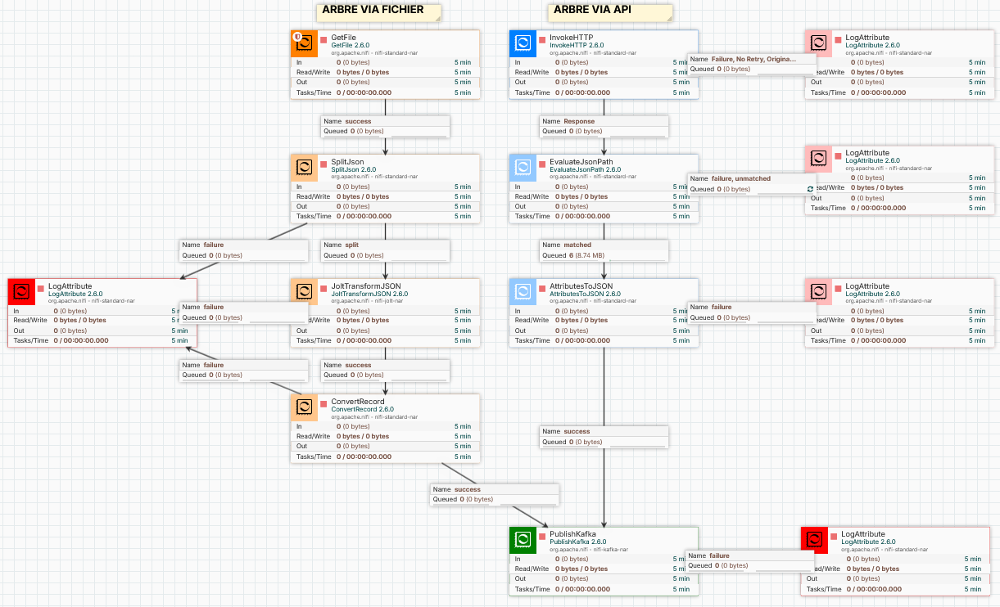
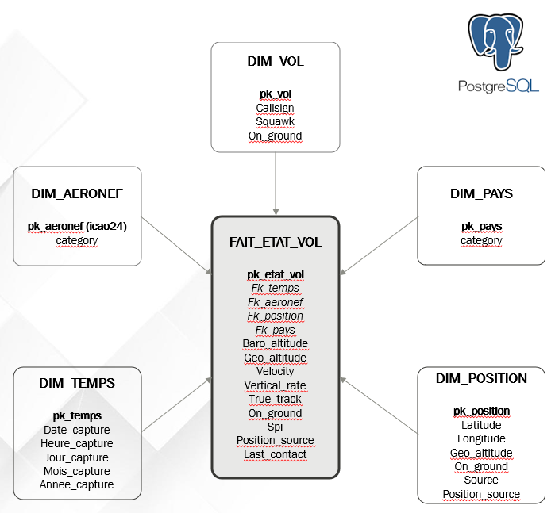
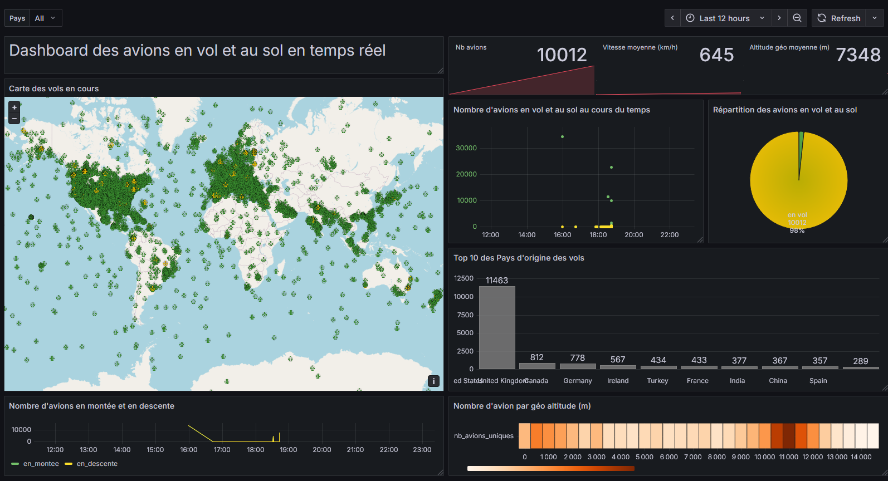
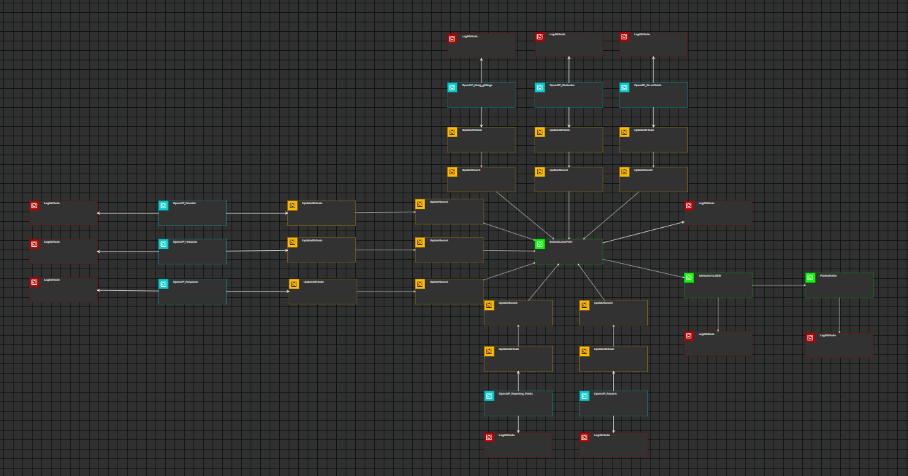
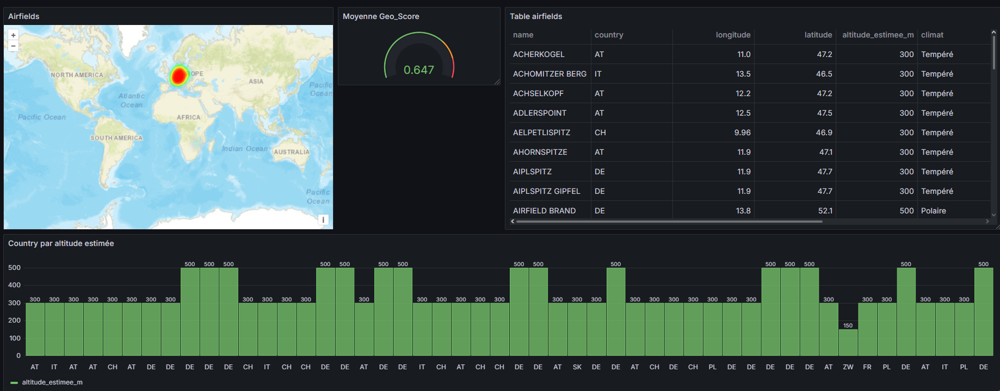

# Données Distribuées / Distributed Data Project

[](https://www.docker.com/)
[](https://spark.apache.org/)
[](https://kafka.apache.org/)
[](https://nifi.apache.org/)

**Repository / Dépôt :** [BeanEden/Donnees_distribuees](https://github.com/BeanEden/Donnees_distribuees)

**Auteurs / Authors :** Ludovic Picard, JC Loirat
**Date :** 31/10/2025

---

## 1. Contexte / Context

**FR :**
Ce projet démontre la mise en place de pipelines pour le traitement de données distribuées à partir de deux APIs distinctes : Opensky et OpenAIP. Chaque API est connectée à un flux complet via NiFi, Kafka, Spark et PostgreSQL. Les données peuvent ensuite être visualisées via Grafana.

**EN:**
This project demonstrates the implementation of pipelines for distributed data processing from two distinct APIs: Opensky and OpenAIP. Each API is connected to a full pipeline through NiFi, Kafka, Spark, and PostgreSQL. Data can then be visualized using Grafana.

---

## 2. Architecture


* **FR :** Chaque pipeline suit le chemin API → NiFi → Kafka → Spark → PostgreSQL → Grafana.
* **EN:** Each pipeline follows the path API → NiFi → Kafka → Spark → PostgreSQL → Grafana.
### Architecture du pipeline Opensky


### Architecture du pipeline OpenAIP

---

## 3. Contenu du dépôt / Repository Structure

```text
Donnees_distribuees/
├── spark-apps/
│   └── spark_kafka_to_pg.py    # Application Spark Python
├── docker-compose.yml           # Déploiement complet
├── docker-compose-spark.yml     # Déploiement Spark simplifié
├── template_nifi.xml            # Template NiFi pour Opensky et OpenAIP
├── Présentation.pptx            # Support de présentation et diagrammes
├── .gitignore
└── README.md
```

---

## 4. Installation & Lancement / Installation & Running

### Pré-requis / Prerequisites

* Docker & Docker Compose
* Python3 ≥3.7 pour les scripts Spark
* (Optionnel) NiFi, Kafka, PostgreSQL localement si pas via Docker

### Lancement via Docker / Running with Docker

```bash
git clone https://github.com/BeanEden/Donnees_distribuees.git
cd Donnees_distribuees

# Lancement de tous les services
docker-compose up -d

# Lancement uniquement de Spark
docker-compose -f docker-compose-spark.yml up -d
```

* Importez `template_nifi.xml` dans NiFi.
* Exécutez le script Spark pour Opensky ou OpenAIP :

```bash
spark-submit spark-apps/spark_kafka_to_pg.py
```

---

## 5. Description des Pipelines / Pipeline Description

### 5.1 API Opensky

* Données : position des avions, altitude, vitesse, état (au sol/en vol).
* Limitation : requête toutes les 8 minutes, contournée via fichiers intermédiaires.
* NiFi : deux arbres de traitement (API directe et via fichier), publication sur Kafka.



* Kafka : topic `opensky_states`
* Spark : écoute Kafka, transformation et insertion dans PostgreSQL.
* PostgreSQL : schéma en étoile avec tables `DIM_VOL`, `DIM_AERONEF`, `DIM_PAYS`, `DIM_TEMPS`, `DIM_POSITION`, table de faits `FAIT_ETAT_VOL`.

* Grafana : dashboards avec filtres dynamiques sur temps et pays, requêtes pour état des avions.


### 5.2 API OpenAIP

* Données : aéroports, zones de vol, etc.
* Illimitée dans les requêtes.
* NiFi : Multiples APIs,traitement JSON unique, publication sur Kafka.

* Kafka : topic `openaip_data`
* Spark : ingestion et transformation vers PostgreSQL.
* PostgreSQL : 10 tables distinctes sans relations directes.
* Grafana : visualisation des données de l’API.

---

## 6. Usage / Scénario d’exemple

**FR :**

1. La donnée arrive depuis l'API Opensky ou OpenAIP.
2. NiFi traite et publie les données sur Kafka.
3. Spark consomme Kafka, effectue le traitement et insère dans PostgreSQL.
4. Grafana visualise les données avec filtres sur temps, position, et état.

**EN:**

1. Data arrives from the Opensky or OpenAIP API.
2. NiFi processes and publishes data to Kafka.
3. Spark consumes Kafka, processes the data, and inserts into PostgreSQL.
4. Grafana visualizes the data with filters on time, position, and state.

---

## 7. Extensions possibles / Possible Extensions

* Schéma Avro/Protobuf pour Kafka
* Partitionnement Kafka et clustering Spark
* Intégration avec Data Lake (HDFS/S3)
* Orchestration avec Airflow
* Monitoring Prometheus + Grafana
* Tests automatisés et CI/CD
* Conversion des scripts Spark en Scala/Java pour performance

---

## 8. Contribution

1. Forkez le dépôt / Fork the repo
2. Créez une branche `feature/…` ou `bugfix/…`
3. Ajoutez tests et documentation
4. Pull Request avec description

---

## 9. Licence / License

À remplir selon votre choix / To be filled according to your license choice.

---

## 10. Contact

* **Ludovic Picard**
* **JC Loirat**
